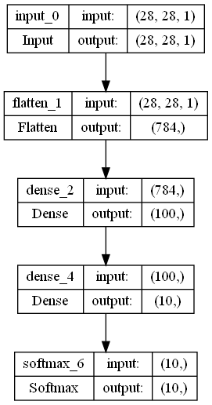
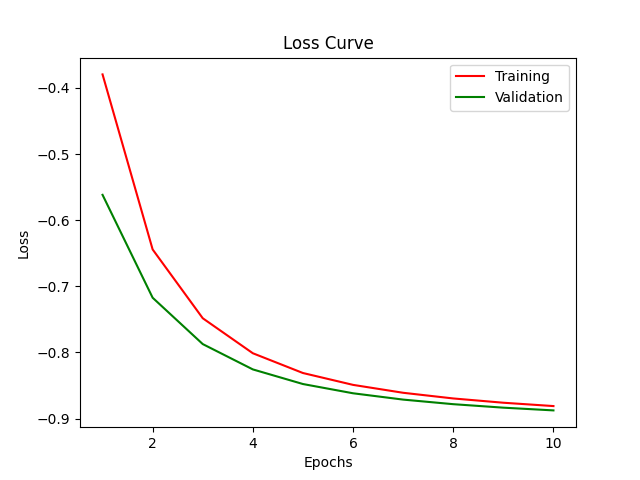
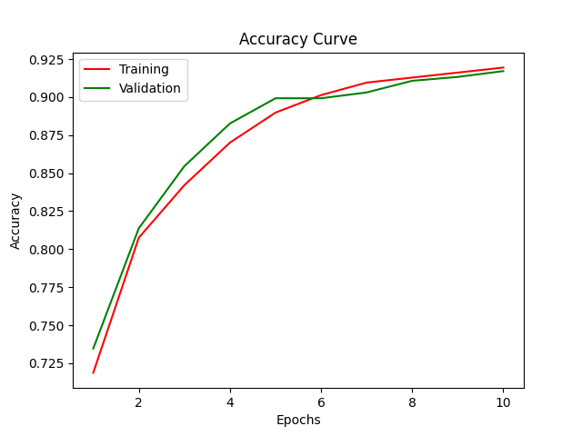

<div align="center">
    
</div>

# Sunstreaker  <font size=2>（以jax为后端的类似keras的框架）</font>

源码清晰明了，使用简单好搞，


## 目标

- [x] 源码清晰简洁，利于算法学习与实验
- [x] 快速实验新改进想法
- [x] 快速复现新论文
- [ ] 快速分布式训练一个大模型
- [ ] 快速使用开源模型权重


## 说明

* 本项目采用小步快走的形式，欢迎start，但不建议fork，因为<font color="red" size=4>更新速度比较快</font>。
* 本项目用于学习与实验，切勿用于生产

## 欢迎关注公众号：无数据不智能

<div align="center">
    
</div>

## 安装
> tensorflow只是加载demo数据需要，也可以不装


### windows 

1. 安装jax
   * cpu 
   ```
   pip install jax[cpu]==0.3.14 -f https://whls.blob.core.windows.net/unstable/index.html --use-deprecated legacy-resolver
   ```
   * gpu
   ```
   pip install jax[cuda111]==0.3.14 -f https://whls.blob.core.windows.net/unstable/index.html --use-deprecated legacy-resolver
   ```
2. 安装Graphviz
   * [exe安装下载](http://graphviz.org/download/)
   * pygraphviz
   ```
    pip install --global-option=build_ext `
                  --global-option="-IC:\Program Files\Graphviz\include" `
                  --global-option="-LC:\Program Files\Graphviz\lib" `
                  pygraphviz
   ```
3. pip install -r requirements.txt
### linux
1. 安装jax

   - cpu

   ```
   pip install --upgrade jax[cpu]==0.3.14
   ```

   - gpu

   ```
   pip install --upgrade jax[cuda]==0.3.14 -f https://storage.googleapis.com/jax-releases/jax_cuda_releases.html
   ```

2. [安装Graphviz](http://graphviz.org/download/)

3. pip install -r requirements.txt


## 使用


### 用tensorflow_datasets搞些数据

```python
import tensorflow as tf

tf.config.set_visible_devices([], 'GPU')
import math
import asyncio
import tensorflow_datasets as tfds
from sunstreaker.data import Dataloader
from sunstreaker.layers import Flatten
from sunstreaker.activations import Softmax
import jax.numpy as jnp
from sunstreaker.losses import categorical_crossentropy
from sunstreaker.metrics import categorical_accuracy
from sunstreaker.optimizers import RMSProp


def load(batch_size: int, func):
    async def tfds_load_data() -> Dataloader:
        ds, info = tfds.load(name="mnist", split=["train", "test"], as_supervised=True, with_info=True,
                             shuffle_files=True, batch_size=batch_size)
        train_ds, valid_ds = ds
        train_ds, valid_ds = func(train_ds), func(train_ds)
        train_ds, valid_ds = train_ds.cache().repeat(), valid_ds.cache().repeat()
        input_shape = tuple(list(info.features["image"].shape))
        num_train_batches = math.ceil(info.splits["train"].num_examples / batch_size)
        num_val_batches = math.ceil(info.splits["test"].num_examples / batch_size)
        return Dataloader(
            train_data=iter(tfds.as_numpy(train_ds)), val_data=iter(tfds.as_numpy(valid_ds)),
            input_shape=input_shape, batch_size=batch_size,
            num_train_batches=num_train_batches, num_val_batches=num_val_batches
        )

    return asyncio.run(tfds_load_data())


def load_dataset(batch_size: int):
    def func(ds):
        return ds.map(lambda x, y: (tf.divide(tf.cast(x, dtype=tf.float32), 255.0), tf.one_hot(y, depth=10)))

    return asyncio.run(load(batch_size, func))


def load_dataset_muti(batch_size: int):
    def func(ds):
        return ds.map(lambda x, y: ({"img": tf.divide(tf.cast(x, dtype=tf.float32), 255.0)}, {"out1": tf.one_hot(y, depth=10)}))

    return asyncio.run(load(batch_size, func))
```

### 序贯式编程

```python3
from sunstreaker.engine.sequential import Model

data = load_dataset(batch_size=1024)
model = Model([Input(input_shape=(28, 28, 1)), Flatten(), Dense(100), Dense(10), Softmax()])
```

### 函数式编程

```python
data = load_dataset_muti(batch_size=1024)
inputs = Input(input_shape=(28, 28, 1), name="img")
flatten = Flatten()(inputs)
dense1 = Dense(100, activation='relu')(flatten)
dense2 = Dense(10, use_bias=False)(dense1)
outputs = Softmax(name="out1")(dense2)

from sunstreaker.engine.functional import Model

model = Model(inputs=inputs, outputs=outputs)
```


### 当你是一个老手

```python3
from sunstreaker import Model

data = load_dataset(batch_size=1024)

class MyModel(Model):
    def build(self, rng=None):
        self.W = self.add_weight((784, 10))
        self.flatten = Flatten()
        self.softmax = Softmax()
        return (10,), [(self.W,)]

    def call(self, params, inputs, trainable=True, **kwargs):
        self.W, = params[0]
        x = self.flatten.forward(params=[], inputs=inputs)
        x = jnp.dot(x, self.W)
        y = self.softmax.forward(params=[], inputs=x)
        return y


model = MyModel()
```

### 编译、训练、保存

```python3
model.compile(loss=categorical_crossentropy, optimizer=RMSProp(lr=0.001), metrics=[categorical_accuracy])
model.fit(data, epochs=10)
model.save("tfds_mnist_v2")
```

### 模型结构打印

```python3
model.summary()
model.plot_model() 
```

```commandline
+--------+-----------+---------+-------------+--------------+
| number | name      | class   | input_shape | output_shape |
+--------+-----------+---------+-------------+--------------+
| 0      | input_0   | Input   | (28, 28, 1) | (28, 28, 1)  |
| 1      | flatten_1 | Flatten | (28, 28, 1) | (784,)       |
| 2      | dense_2   | Dense   | (784,)      | (100,)       |
| 3      | dense_4   | Dense   | (100,)      | (10,)        |
| 4      | softmax_6 | Softmax | (10,)       | (10,)        |
+--------+-----------+---------+-------------+--------------+
```

<div align="left">
    
</div>

### 损失与评价可视化

```python
model.plot_losses()
model.plot_accuracy()
```
<div align="left">
    
</div>
<div align="left">
    
</div>


## 功能

| activations |  layers   |             losses             |              metrics              | optimizers |
| :---------: | :-------: | :----------------------------: | :-------------------------------: | :--------: |
|   Linear    |   Dense   |      binary_crossentropy       |          binary_accuracy          |    SGD     |
|   Softmax   |  Flatten  |    categorical_crossentropy    |             accuracy              |    SM3     |
|    Relu     |  Dropout  |       mean_squared_error       |       categorical_accuracy        |  Adagrad   |
|   Sigmoid   |  Conv2D   |      mean_absolute_error       |    sparse_categorical_accuracy    |    Adam    |
|     Elu     | MaxPool2D | mean_squared_logarithmic_error |    cosine_similarity_accuracy     |   Adamax   |
|  LeakyRelu  | AvgPool2D |             hinge              |    top_k_categorical_accuracy     |  RMSProp   |
|    Gelu     |    GRU    |         kl_divergence          | sparse_top_k_categorical_accuracy |    FTRL    |
|             |           |             huber              |                                   |            |


## 引用

* https://github.com/google/jax
* https://github.com/google/flax
* https://github.com/keras-team/keras
* https://github.com/umangjpatel/kerax
* https://github.com/bojone/bert4keras
* https://github.com/ddbourgin/numpy-ml
* https://github.com/huggingface/transformers

